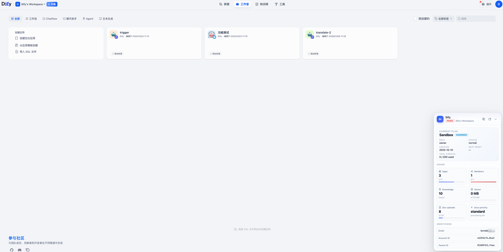
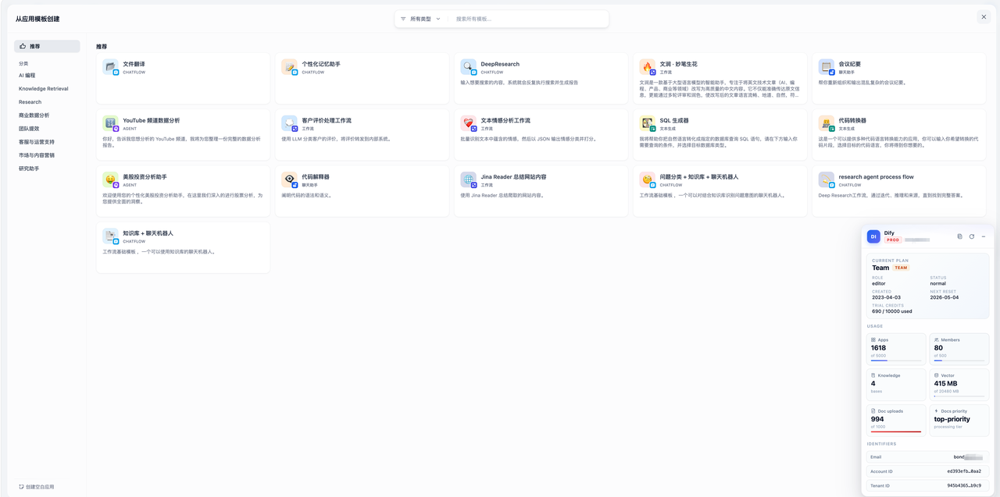
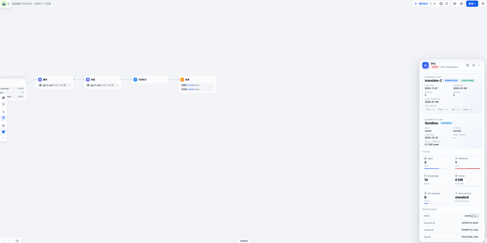

# Dify Helper (Chrome / Edge Extension)

A zero-dependency browser extension that overlays a floating panel on **cloud.dify.ai** showing your tenant, account, subscription, and the current app / workflow — plus a one-click Markdown snapshot for bug reports and support tickets.

## Screenshots

| Sandbox | Team | App detail |
| --- | --- | --- |
|  |  |  |

> `images/` — original Retina captures (~2.5 MB total), kept as an archive.
> `dist/screenshots/` — web-optimized 1280 px versions (~390 KB total, used above).
> `dist/store-screenshots/` — 1280×800 RGB PNGs ready for Chrome Web Store upload.

## Install (developer mode)

1. **Chrome** → open `chrome://extensions` **·** **Edge** → open `edge://extensions`
2. Toggle **Developer mode**
3. Click **Load unpacked** and select this folder
4. Open [cloud.dify.ai](https://cloud.dify.ai) — the panel appears in the bottom-right corner

## How it works

The content script runs on `cloud.dify.ai` and reuses the page's existing session cookie (`credentials: 'include'`) plus the CSRF token from the `csrf_token` / `__Host-csrf_token` cookie, so **no extra login is required**.

Before injecting any UI it probes `GET /console/api/setup`:

- `200 / 401 / 403` → it's a Dify console → inject the panel
- `404 / network error` → bail out silently

### Data sources

**Workspace-level (loaded once per refresh):**

| Field | Endpoint |
| --- | --- |
| Email / Account ID / Name | `GET  /console/api/account/profile` |
| Tenant ID / Plan / Role | `POST /console/api/workspaces/current` |
| Subscription / Quotas | `GET  /console/api/features` |
| App count | `GET  /console/api/apps?page=1&limit=1` |
| Knowledge base count | `GET  /console/api/datasets?page=1&limit=1` |
| Member count | `GET  /console/api/workspaces/current/members` |

**App-level (loaded automatically when URL matches `/app/{uuid}/...`):**

| Field | Endpoint |
| --- | --- |
| App name / mode / description / created_by | `GET /console/api/apps/{id}` |
| Workflow graph (nodes, edges) | `GET /console/api/apps/{id}/workflows/draft` |
| Published version metadata | `GET /console/api/apps/{id}/workflows/publish` |

SPA route changes are detected via a 300 ms `location.href` poll + `popstate` listener, so switching apps auto-refreshes the app card. Workspace data is *not* refetched on navigation — only on explicit **↻**.

All data lives in your browser. Nothing is sent to any third-party service.

## Panel controls

| Button | Action |
| --- | --- |
| 📋 (stacked) | Copy the whole panel as a Markdown snapshot |
| ↻ | Refresh data |
| − | Collapse to a floating orb (click orb to restore) |
| Any `Identifiers` row | Copy just that value |

UI state (minimized / not) is persisted in `localStorage` under `dify-helper-ui-state`.

### Sample Copy-All output

On a workflow editor page the `## Current App` section is appended automatically:

```md
# Dify Workspace Snapshot

- Environment: PROD (cloud.dify.ai)
- Captured at: 2026-04-23T13:45:12.000Z

## Account
- Email: brian@example.com
- Account ID: 3ffdf8c9-84f9-4f7a-953a-b8ae01bf1d08
- Name: Brian

## Workspace
- Name: Brian's Workspace
- Tenant ID: 0397d784-db6a-4cc2-9e03-81911e450140
- Role: owner
- Status: normal
- Created: 2026-02-19

## Subscription
- Plan: Professional
- Billing enabled: yes
- Trial credits: 120 / 200
- Next credit reset: 2026-05-19

## Usage
- Apps: 12 (quota 12 / 50)
- Members: 3 (quota 3 / 5)
- Knowledge bases: 8
- Vector space: 120 MB / 2048 MB
- Doc upload quota: 45 / 500
- Docs processing priority: priority

## Current App
- Name: Customer Support Bot
- App ID: ccd9a03c-c4a9-4de6-b43f-d7872731c717
- Mode: Chatflow
- Description: Handles tier-1 customer support tickets
- Created: 2026-02-20 by Brian
- Updated: 2026-04-15
- Workflow nodes: 14 (llm×3, tool×4, code×2, if-else×2, ...)
- Workflow edges: 17
- Published: yes (2026-04-10)
```

## Files

```
manifest.json     MV3 manifest — single host permission: cloud.dify.ai
content.js        Probe, fetch, Shadow-DOM overlay (the whole extension)
icons/            SVG source + rendered PNG icons (16 / 32 / 48 / 128)
images/           README screenshots
PRIVACY.md        Privacy policy (required for Chrome / Edge Web Stores)
LICENSE           MIT
```

## Privacy

See [PRIVACY.md](./PRIVACY.md). Summary: all data stays in your browser; the extension talks only to `cloud.dify.ai` using your existing session; nothing is transmitted, logged, or sold to anyone.

## Uninstall

Remove the extension from `chrome://extensions` / `edge://extensions`. The only local state (`dify-helper-ui-state` in `localStorage`) is cleared when you wipe site data for `cloud.dify.ai`.

## License

[MIT](./LICENSE)
